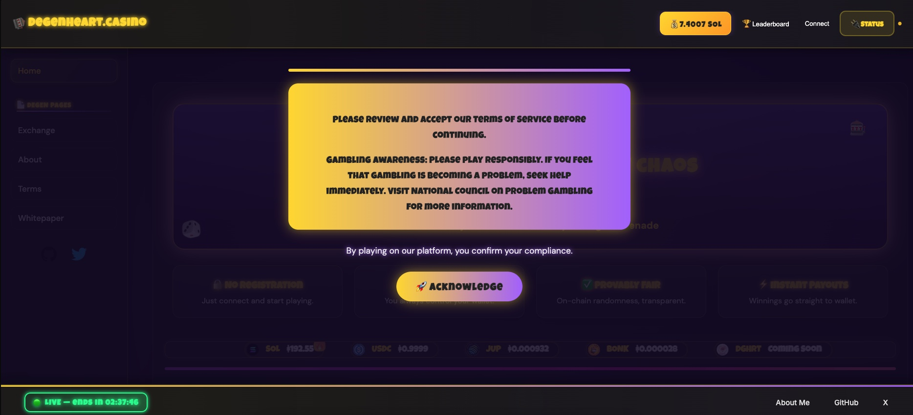
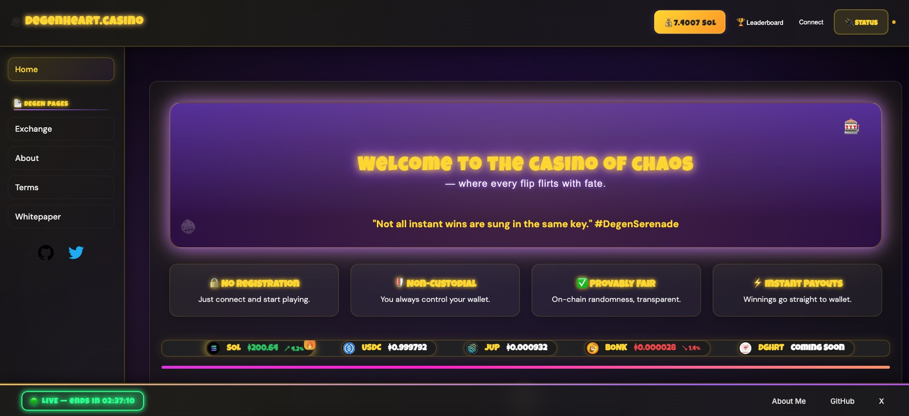
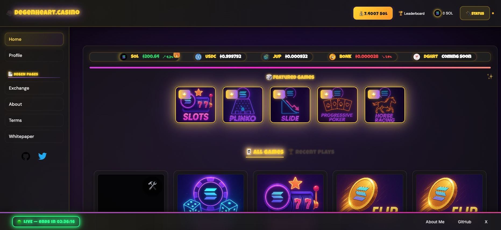

# DegenHeart Casino

<!-- Screenshots (collapsible, thumbnails link to full images below for best GitHub Markdown compatibility) -->

  
Show screenshots

  <!-- Thumbnails that link to anchors below -->
  

    
    
    
  

  <!-- Full-size images with anchors -->
  
  

  
  

  
  

> Looking to build a new game for this platform? Start with the official Hello World Game Template:
> https://github.com/degenwithheart/HelloWorld-Boilerplate

A custom Vite + React frontend for on-chain casino games built on top of the Gamba SDKs. This project started from the gamba-labs/platform codebase but has been heavily refactored and is not a drop‑in replacement.

## Disclaimer (author’s note)
- This repository is a custom build I created for my own usage and brand deployment.
- I am not trying to “muscle in” on, compete with, or replace any existing platform (including gamba-labs/platform).
- This is not an official fork or product offering; it’s a bespoke implementation aligned to my requirements and preferences.
- Please treat this codebase as a reference or inspiration, not as a general-purpose platform template.

Highlights:
- Vite-based build with custom polyfills and Node-browser shims
- React Router–based navigation (multi-page app with additional sections)
- Custom UI/UX, components, and game shells
- Token/pool configuration tuned for this deployment (including DGHRT placeholders)
- Optional Edge API routes for metadata and integrations
- Global error boundaries, access windows, and UX polish

If you are familiar with gamba-labs/platform, read the “Compatibility notes” section to understand why this repository diverges and cannot be used interchangeably.

---

## Tech stack

- Build: Vite + @vitejs/plugin-react
- Framework: React 18
- Routing: react-router-dom
- State: Zustand
- Styling: styled-components (primary) + a minimal Tailwind config present for utility usage
- Solana: @solana/wallet-adapter (Solflare configured by default)
- Gamba: gamba-react-v2, gamba-react-ui-v2
- Misc: Buffer/process/global polyfills, browserified shims for Node built-ins

Key entry points:
- vite.config.ts – custom Vite configuration with aliases, env prefixing, HMR, and manual chunking
- public/index.html / index.html – polyfills and bootstrapping
- src/index.tsx – provider tree, wallet adapters, token metadata provider, routing, and app root
- src/App.tsx – route definitions, global modals, and layout
- src/constants.ts – RPC, explorer URLs, token metadata, pools, fees, TOS, etc.

---

## Compatibility notes (why this is not a drop-in for gamba-labs/platform)

This project diverges from the upstream in several architectural and behavioral areas. The most important differences are summarized below.

1) Build system and polyfills
- Vite config diverges:
  - Uses envPrefix ['VITE_'] and additional define shims (`process.env.ANCHOR_BROWSER`, `global: 'globalThis'`).
  - Adds browser aliases for Node modules (crypto-browserify, stream-browserify, util) and includes `buffer` in optimizeDeps.
  - Disables HMR overlay and configures `manualChunks('vendor')` to bundle node_modules differently.
  - Adds a dev server middleware that intercepts `/api` calls and explicitly returns 404 in development.
- Dedicated polyfills:
  - src/polyfills.ts and inline scripts in public/index.html and index.html set up Buffer, process, and global for browser.
  - Some code paths read `process.env` at runtime in the browser (e.g., to check GAMBA_ENV), which requires the above shims.

2) Runtime and routing
- React Router routes differ from the upstream:
  - Multiple additional pages beyond the original dashboard/game pairing:
    - /terms, /whitepaper, /aboutme, /exchange, /propagation
    - Dedicated game route pattern: `/game/:wallet/:gameName`
    - User profiles: `/:wallet/profile`
  - BrowserRouter uses the “future” flags for v7 behavior.
- The upstream platform routes are simpler (e.g., "/" and "/:gameId"). These route shape changes mean navigation, deep links, and shared links are not compatible between the two codebases.

3) Provider tree and configuration
- Wallet adapters:
  - This repo enables Solflare by default; other wallets (e.g., Phantom) are not pre-wired.
- Token metadata:
  - The TokenMetaProvider is supplied with static TOKEN_METADATA, and the “fetcher” prop is omitted in favor of optional backend routes (see API routes). In the upstream, a fetcher may be provided inline.
- Referral:
  - Referral is supplied via a standalone <ReferralProvider> wrapper here, instead of using the inline `referral` prop of <GambaPlatformProvider> as in the upstream.
- Priority fee:
  - Priority fee is stored and persisted in localStorage with custom UI controls (FeesTab), altering transaction behavior from the out-of-the-box defaults.

4) State shape and persistence
- Zustand store (useUserStore) differs:
  - Removed properties like `lastSelectedPool` and replaced selection persistence with a dedicated effect (PersistSelectedToken) that writes to localStorage.
  - Additional UI flags and behaviors live here and are wired into custom components, not present upstream.

5) Tokens, pools, and platform constants
- RPC, Explorer, and Platform URLs:
  - Uses Solscan for explorer links rather than the gamba explorer.
  - PLATFORM_SHARABLE_URL points to DegenHeart.casino.
  - RPC endpoint defaults to a Helius-powered URL (configurable via VITE_RPC_ENDPOINT).
- Token list diverges:
  - Includes SOL, USDC, JUP, BONK, and a placeholder FAKE “DGHRT” entry with minted=false.
  - Base wagers, decimals, and price fields differ from upstream sample data.
- Fee configuration values are tuned for this deployment (creator, jackpot, referral).

6) Custom components and UX surface
- Rebuilt or new components:
  - Sidebar with deterministic avatar/username from wallet and localStorage.
  - GlobalErrorBoundary and enhanced error flows in games (maintenance/creating gates based on env).
  - FeesTab for quick priority fee presets.
  - GambaResultModal (custom post-play display).
  - JackpotModal, BonusModal, ConnectionStatus, ScreenSizeWarning, etc.
- Dashboard and content:
  - “About Me” and “Whitepaper” sections, rich copy, and branding assets not present upstream.
  - Theming, neon animations, and casino-grade styling throughout via styled-components (with extra responsiveness).
- Recent Plays, Share modal, and game overlays are customized for this branding and route structure.

7) Games and shells
- Game implementations (Roulette, Slots, Limbo, DiceRoll, Scissors, etc.) use custom overlays, paytables, and UI choreography different from the upstream.
- Some game flows use a two-phase state (e.g., betting vs spinning), extra overlays for thinking phases, and styled-components animations that are project-specific.
- Route params and expectations for a game’s URL and the “wallet” context differ from upstream, so embedding or linking games between the repos is incompatible.

8) API routes (Edge/serverless)
- This repo includes serverless routes under /api intended for Vercel Edge or similar:
  - `api/auth.ts` (Edge runtime) validates a password using `process.env.ACCESS_OVERRIDE_PASSWORD`.
  - `api/changenow-coins.js` and others (e.g., a Helius metadata proxy) are referenced by the frontend via relative paths.
- The Vite dev server intentionally 404s /api routes to prevent local misuse; deployments are expected to supply serverless function support. The upstream template doesn’t enforce this pattern.

9) Styling system
- Primary styling is via styled-components with extensive animation and responsive rules inside components.
- A Tailwind config exists but is minimal and used sparingly; the upstream relies purely on CSS/styled-components with different tokens and design primitives.
- Global CSS variables and theme choices differ; component class names and expectations diverge.

Taken together, these changes alter:
- How the app starts (build pipeline + polyfills),
- How it’s navigated (route shapes),
- What providers are used and how (wallets, token metadata, referral),
- The internal state model,
- The data it expects (tokens/pools/explorer),
- The UI components and composition,
- And how/where it calls backend/edge APIs.

As a result, attempting to “swap” code or configuration between this repo and gamba-labs/platform will generally not work without deliberate adaptation.

---

## Architecture overview

- Entry and bootstrap
  - public/index.html and index.html provide Buffer/process/global polyfills before mounting React.
  - src/index.tsx composes providers: ConnectionProvider → WalletProvider → WalletModalProvider → TokenMetaProvider → SendTransactionProvider → GambaProvider → GambaPlatformProvider → App.
  - BrowserRouter is enabled with v7 “future” flags for predictable navigation.

- App layout and routes
  - src/App.tsx defines global modals, error handling, toasts, and page routes:
    - / – Dashboard
    - /:wallet/profile – User profiles
    - /game/:wallet/:gameName – Dedicated game pages
    - /terms, /whitepaper, /aboutme, /exchange, /propagation – Additional sections/tools

- State and persistence
  - src/hooks/useUserStore.ts stores UI state (e.g., newcomer, userModal, gamesPlayed) and is persisted in localStorage.
  - Token selection is persisted by observing GambaPlatform context and writing the selected pool mint to localStorage.

- Tokens and pools
  - src/constants.ts configures RPC, fees, explorer URL, PLATFORM_SHARABLE_URL, tokens (SOL/USDC/JUP/BONK/DGHRT Fake), and pools.
  - Optional metadata fetching is proxied through an API route rather than injecting a fetcher into TokenMetaProvider by default.

- API integration (optional, deployment-dependent)
  - api/auth.ts (Edge runtime) – lightweight gate via ACCESS_OVERRIDE_PASSWORD.
  - api/changenow-coins.js – curated symbol list for an exchange UI.
  - Additional endpoints like /api/helius can be used by constants/helpers as needed.
  - Vite dev server blocks /api during development (intentional).

- Games
  - src/games/* host custom UIs for DiceRoll, Limbo, Roulette, Slots, Scissors, etc., with bespoke animations, overlays, and paytables.
  - src/sections/Game handles preloading, loading bars, thinking phases, transaction modals, and provably fair modals.

- Styling
  - styled-components for component-scoped styles and animations.
  - src/styles.css sets global CSS variables for Gamba UI; Tailwind config exists for selective utility use.

---

## Configuration overview

Environment and constants are primarily defined in src/constants.ts and import via Vite’s VITE_ prefixed env vars. Notable values:
- VITE_RPC_ENDPOINT – RPC endpoint (defaults to a Helius URL if not supplied)
- PLATFORM_CREATOR_ADDRESS – fee recipient
- PLATFORM_*_FEE – fees (creator/jackpot/referral/multiplayer)
- Explorer URL and sharable URL are tuned for Solscan and DegenHeart.casino
- Token list includes real tokens and a placeholder DGHRT entry (minted=false)

Some components read process.env at runtime behind a polyfill for certain display logic (e.g., gate maintenance banners). Serverless/Edge functions may use non-VITE envs (like ACCESS_OVERRIDE_PASSWORD).

---

## Related repositories

- HelloWorld Game Template (HelloWorld-Boilerplate)
  - Official starter template for building DegenCasino-compatible games.
  - Includes portal integration, overlays, live statistics, and the DegenCasino routing pattern (`/game/:wallet/:gameName`).
  - Repo: https://github.com/degenwithheart/HelloWorld-Boilerplate

---

## Acknowledgements

- Gamba Labs – core SDKs, architecture concepts, and the original platform template that inspired this build.
- Solana Wallet Adapter contributors.
- The broader Solana and Web3 community.

This repository takes the upstream ideas and re-implements significant portions of the build system, routing, configuration, and UI/UX to fit a bespoke deployment and brand.
